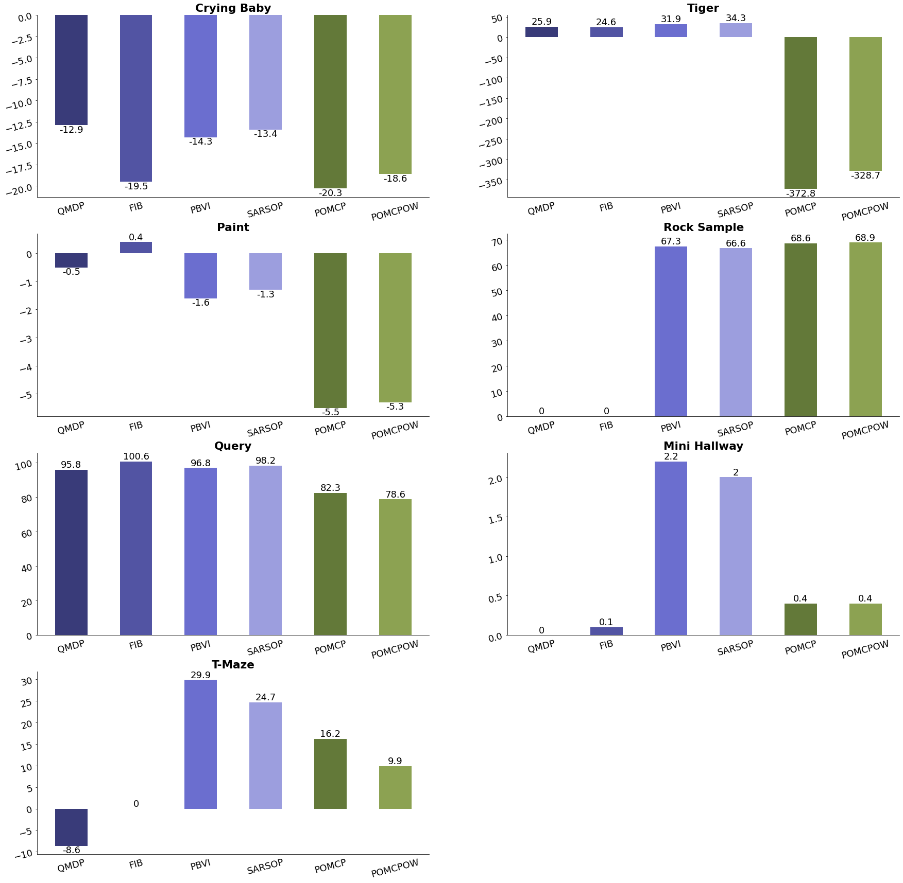
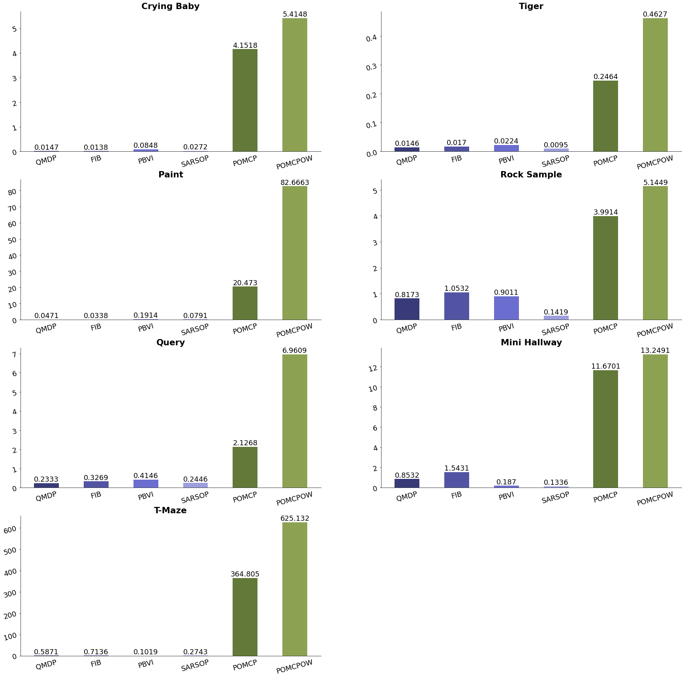

# [Empirical Analysis with POMDPs.jl Library: A Comparative Study](https://github.com/aliceyshu/8010_project)

In this study, we aim to perform an empirical analysis of multiple algorithms using the package **[POMDPs.jl](https://github.com/JuliaPOMDP/POMDPs.jl) **and examine the performance of each algorithm.

This study is part of DS8010 -Interactive Learning in Decision Process course project, Winter 2023 term. Details about the course can be found [here](https://www.torontomu.ca/graduate/datascience/courses/).

## POMDP Problems

1. Crying baby
2. Tiger problem
3. Paint problem
4. Query problem
5. Mini hallway problem
6. Rock sample problem
7. T-Maze problem

## Algorithm

We solve the above POMDP problem using the algorithms listed below:

1. QMDP
2. Successive Approx-imations of the Reachable Space under Optimal Policies(SARSOP)
3. Partially Observable Monte Carlo Planning (POMCP)
4. POMCP with observation widening (POMCPOW)
5. Fast Informed Bound (FIB)
6. Point-Based Value Iteration (PBVI)

## Installation

Requires Julia 1.8.1 or newer. To download Julia, go to [julialang.org/downloads](julialang.org/downloads)

When Julia is installed, open Julia terminal and install the [POMDPs.jl package](https://github.com/JuliaPOMDP/POMDPs.jl) version 0.9.5 or newer using below:

```julia
using Pkg
Pkg.add("POMDPs")
```

And install other required packages

```julia
Pkg.add("DataFrames")
Pkg.add("CSV")
Pkg.add("ElectronDisplay")
Pkg.add("POMDPModels")
Pkg.add("ParticleFilters")
Pkg.add("POMDPLinter")
Pkg.add("Random")

Pkg.add("QMDP")
Pkg.add("FIB")
Pkg.add("PointBasedValueIteration")
Pkg.add("SARSOP")
Pkg.add(BasicPOMCP")
Pkg.add("POMCPOW")
```

## Quick Start

To run this experiment, open the **[main.jl](https://github.com/aliceyshu/8010_project/blob/main/Main.jl) **and run the entire file in Julia.

An simple example of how to implement a tiger problem individually is open the tigerProblem_solvers.jl in **[problems_simulation](https://github.com/aliceyshu/8010_project/tree/main/problems_simulation)** folder and call the solver function below

```julia
include("problems_simulation/tigerProblem_solvers.jl")

# do not print belief, each round contain 1000 trials, 10 rounds
run_tiger_solvers(false, 1000,10)
```

The code above will then record the experiment result, such as runtime, reward, discounted rewar, etc., for each problem in the **[result](https://github.com/aliceyshu/8010_project/tree/main/results)** folder.

After complete the experiment for all problems. Open jupyter file **[results/summary_results.ipynb](https://github.com/aliceyshu/8010_project/blob/main/results/summary_results.ipynb) **and organize the result into performance matrix and generate types of plots.

## Outcomes

Results of the experiments can be found in jupyter file: [results/summary_results.ipynb](https://github.com/aliceyshu/8010_project/blob/main/results/summary_results.ipynb)

An organize performance matrix csv file can be found in: [results/summary.csv](https://github.com/aliceyshu/8010_project/blob/main/results/summary.csv)

### Grouped bar plot for discounted reward



### Grouped Bar plot for runtime



## Report

- Project Proposal can be found here: [DS8010_Yang_Research_Proposal.pdf](https://github.com/aliceyshu/8010_project/blob/main/DS8010_Yang_Research_Proposal.pdf)
- Intermediate report can be found here: [DS8010_Project_Report_Yang_Part1.pdf](https://github.com/aliceyshu/8010_project/blob/main/DS8010_Project_Report_Yang_Part1.pdf)
- Final complete report can be found here: [DS8010_Project_Report_Yang.pdf]()

## Timeline

- [X] Timeline•Week 1-2 (March 13-26)
  - [X] Review relevant literature on POMDPs and their algorithms
  - [X] Prepare the POMDPs problems (crying baby, paint problem, query problem)for evaluationand evaluate the performance of each algorithm on the selected POMDPs problems
  - [X] diagrams to explain the problem, architecture of the algorithm
- [X] Week 3-4 (March 27-April 9)
  - [X] Review relevant literature on POMDPs and their algorithms, and complete intermediatereport (introduction, literature review, methods section) which is due **April 10**
  - [X] Prepare the POMDPs problems (simple grid world problem/ maze problem) and evaluatethe performance of each algorithm on the selected POMDPs problems
- [X] Week 5-6 (April 10-23)
  - [X] Prepare the remaining POMDPs problems (simple grid world problem/ maze problem) andevaluate the performance of each algorithm on the selected POMDPs problems
  - [X] Draft the research report (experimental setup, results, conclusions)
- [X] Week 7 (April 24-26)
  - [X] Review and finalize the research report, submit the research report by thedue date of **April 26**

# Reference

- Edward Balaban Tim A. Wheeler Jayesh K. Gupta Maxim Egorov, Zachary N. Sunberg andMykel J. Kochenderfer.  POMDPs.jl: A Framework for Sequential Decision Making under Un-certainty.Journal of Machine Learning Research, 18, April 2017

# License

[LICENSE.md](https://github.com/aliceyshu/8010_project/blob/main/LICENSE.md)
